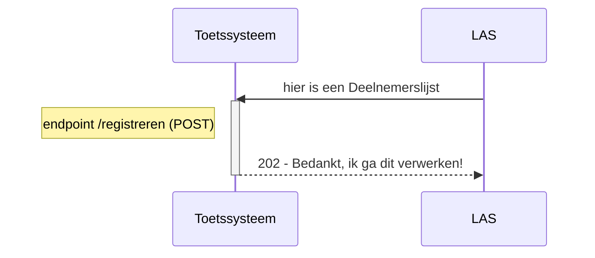
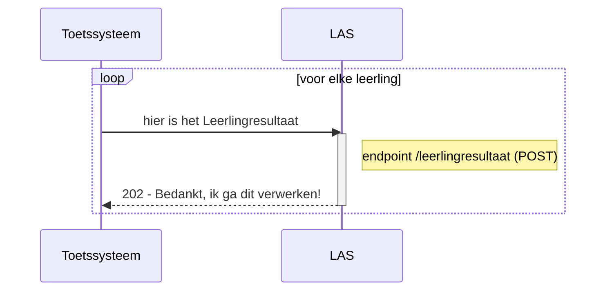
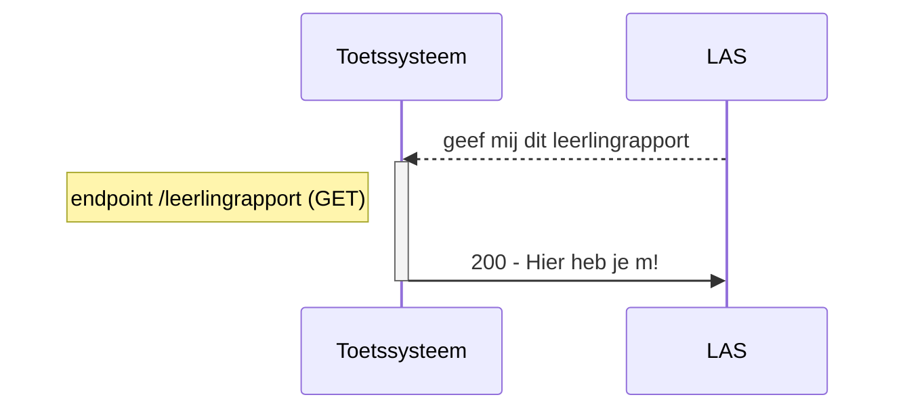

# Doorstroomtoets
API-definities voor Logistieke proces rondom de Doorstroomtoets in het PO bij afsprakenset "Logistiek Proces Doorstroomtoets PO"
De OAS3-definities (Defs) in YAML-bestand "doorstroomtoets-openapi.yaml" in de folder "definities" zijn bedoeld voor de REST API t.b.v. Logisieke proces rondom de Doorstroomtoets PO versie 1.0 (voor schooljaar 2023-2024). Zie hiervoor het volgende YAML-bestand https://raw.githubusercontent.com/JosVanderArend/doorstroomtoets/main/swagger/doorstroom-openapi.yaml.

Deze uitwisseling omvat 3 interacties die schematisch worden gepresenteerd in de drie onderstaande sequencediagrammen.

Iedere publicatie van dit YAML-bestand voor de doorstroomtoetsketen is een getagde versie en is beschikbaar onder releases: https://github.com/JosVanderArend/doorstroomtoets/releases. Daar zijn tevens hulpmiddelen beschikbaar om getagde versies te vergelijken. 
Er kan maximaal worden teruggekeken naar en vergeleken met de eerste versie 1.0 (voor schooljaar 2023-2024).

Indien er problemen of verbetersuggesties zijn specifiek over de YAML dan graag indienen onder issues: https://github.com/JosVanderArend/doorstroomtoets/issues.

De actuele versie van deze OAS3-definities kan met de Swagger Editor worden ingezien via deze link: [https://github.com/JosVanderArend/doorstroomtoets/blob/main/swagger/doorstroom-openapi.yaml](https://raw.githubusercontent.com/JosVanderArend/doorstroomtoets/main/swagger/doorstroom-openapi.yaml). 
 
